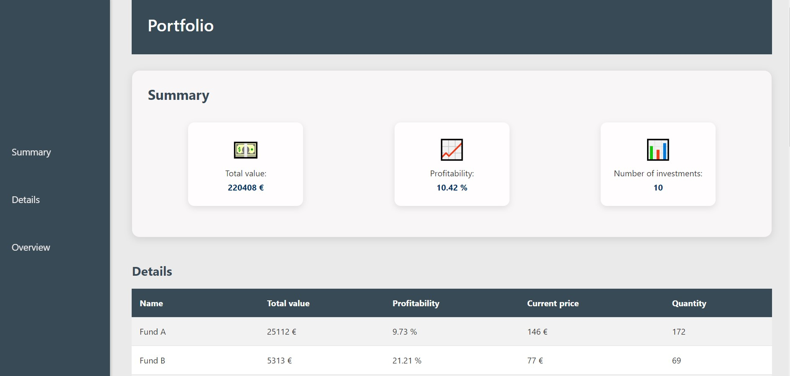
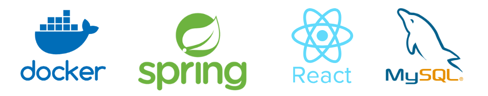

### Overview

This app provides a concise overview of an investment portfolio, summarizing all investments and offering detailed insights for each. Users can easily monitor total values, prices, and quantities, focusing on profitability and overall investment performance. Profitability is calculated using the XIRR method, which accurately accounts for irregular cash flows, transaction fees, and dividends.

### Preview


### Tech stack


### Getting started
``` 
# Clone this repository
$ git clone https://github.com/katlinteern/bank-test

# Go into the repository
$ cd bank-test/

# Start project
$ docker-compose up
``` 
Check that all Docker containers are running and that spring-boot-app container has finished creating data. 

App will be available on http://localhost:3000/

